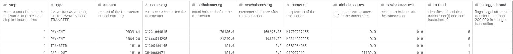

# Introduction
  Every year, billions of banking transactions occur in the United States. While only a small portion of those are fraudulent, the results can be devastating is a fraudulent transaction is not discovered. Costs include damage to the customer, to the company, and to regulator agencies tasked with confirming validity of payments.

# Project goal
  Design a system capable of automatically detecting fradualent transactions.

# Data sources
  Simulated banking transaction from https://www.kaggle.com/ntnu-testimon/paysim1 contaning 6 million transactions
  
# Data Description

 
# Model 1

# Model 2

# Model 3

# Model Stacking:-
